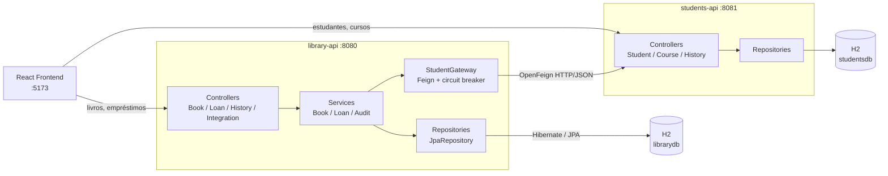
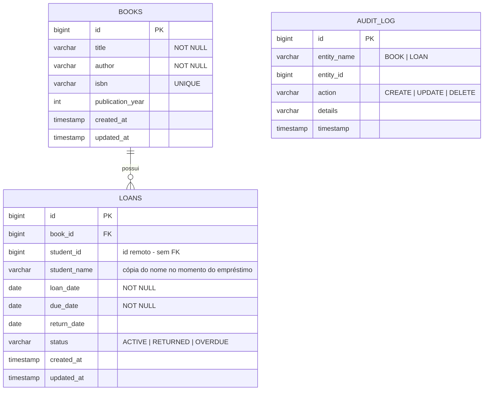

# Library API — Sistema de Biblioteca

API REST de gerenciamento de biblioteca desenvolvida na disciplina **Engenharia de Softwares Escaláveis** (Projeto de Bloco).

- **TP1** — Monólito simples com Spring Boot: arquitetura em camadas (controller → service → repository), API REST com Spring MVC e front-end React ([library-frontend](../library-frontend)).
- **TP2** — Camada de persistência real com **JPA + Spring Data**: mapeamento objeto-relacional, repositórios com consultas derivadas e `@Query`, **histórico de mudanças dos dados (auditoria)** e testes automatizados da camada de persistência.
- **TP3** — Extração do domínio de estudantes para um **microsserviço** ([students-api](../students-api)), com comunicação distribuída via **Spring Cloud OpenFeign** e resiliência com **circuit breaker (Resilience4j)**.

## Tecnologias

| Tecnologia | Uso |
|---|---|
| Java 21 / Spring Boot 4.1.0 | Base da aplicação (autoconfiguração, injeção de dependências) |
| Spring Web MVC | API REST (`@RestController`, `@GetMapping`, ...) |
| Spring Data JPA + Hibernate | Mapeamento objeto-relacional e repositórios |
| **Spring Cloud OpenFeign** | Cliente HTTP declarativo para o microsserviço `students-api` |
| **Spring Cloud CircuitBreaker + Resilience4j** | Tolerância a falhas na comunicação entre serviços |
| Bean Validation (Jakarta) | Validação dos payloads de entrada |
| H2 Database | Banco relacional em memória |
| Lombok | Redução de boilerplate (`@Data`, construtores) |
| JUnit 5 + AssertJ + Mockito | Testes automatizados (`@DataJpaTest`, `@SpringBootTest`) |

> As duas aplicações usam **Spring Boot 4.1.0** e **Java 21**; a `library-api` acrescenta o BOM `spring-cloud-dependencies:2025.1.2`, que é o release train compatível com o Boot 4.x.

## Arquitetura

Design em camadas, cada uma com responsabilidade única (SOLID):

```
Controller  →  Service  →  Repository  →  Banco de dados (H2)
  (HTTP)      (regras de     (Spring Data JPA)
               negócio +          ↘
               auditoria)          StudentGateway → (HTTP) → students-api
```

### Diagrama de componentes (TP3)



### O que mudou do TP2 para o TP3

| | TP2 (monólito) | TP3 (microsserviço) |
|---|---|---|
| Entidade `Student` | Dentro da `library-api` | Só no `students-api` |
| Tabela `students` | No `librarydb` | No `studentsdb` |
| `Loan` → aluno | `@ManyToOne` com FK `student_id` | Coluna `student_id` (`Long`), **sem FK** |
| Integridade aluno↔empréstimo | Garantida pelo banco | Garantida pelo `StudentGateway` (camada de serviço) |
| `GET /api/students` | Servido pela `library-api` | Servido pelo `students-api` (:8081) |
| Falha do cadastro de alunos | Impossível (mesmo processo) | Tratada com circuit breaker e resposta degradada |

## Comunicação entre os serviços

### Cliente declarativo (OpenFeign)

A `library-api` não conhece a entidade `Student`, apenas um contrato de leitura:

```java
@FeignClient(name = "students-api", url = "${students-api.url}")
public interface StudentClient {
    @GetMapping("/api/students")        List<StudentDto> findAll();
    @GetMapping("/api/students/{id}")   StudentDto findById(@PathVariable("id") Long id);
}
```

O `StudentDto` é uma **projeção**: só os campos que a biblioteca usa. Campos novos no microsserviço são ignorados, então o `students-api` pode evoluir o modelo sem quebrar a `library-api`.

A URL vem de `students-api.url` no `application.properties` — mudar de ambiente é configuração, não código.

### Resiliência (circuit breaker)

Todo acesso remoto passa pelo [`StudentGateway`](src/main/java/com/infnet/libraryapi/service/StudentGateway.java), que envolve o Feign em um circuit breaker do Resilience4j e separa três situações que **só passam a existir depois da separação em microsserviços**:

| Situação | Como o gateway trata | Resposta HTTP |
|---|---|---|
| Aluno existe | Retorna os dados | `200` / `201` |
| Aluno não existe (`404` do microsserviço) | `Optional.empty()` — **não** conta como falha, não abre o circuito | `409` com a mensagem de negócio |
| Microsserviço fora do ar / timeout | Modo estrito lança `StudentServiceUnavailableException`; modo tolerante devolve vazio | `503` na escrita, resposta degradada na leitura |

Isso dá dois modos de uso deliberados:

- **Estrito** (`findRequired`) — usado ao **criar** um empréstimo, onde não dá para prosseguir sem confirmar o aluno.
- **Tolerante** (`tryFindById` / `indexAll`) — usado apenas para **enriquecer listagens**: com o microsserviço fora do ar, a `library-api` continua respondendo, caindo para o nome do aluno copiado no próprio empréstimo e marcando `studentDataAvailable: false`.

O `indexAll()` carrega todos os alunos em **uma única chamada HTTP** e indexa por id, em vez de uma requisição por empréstimo (evita o N+1 distribuído).

> O circuit breaker automático do Feign (`spring.cloud.openfeign.circuitbreaker.enabled`) fica **desligado de propósito**: ele envolveria as exceções em `NoFallbackAvailableException` e o gateway não conseguiria mais distinguir um `404` de uma falha de comunicação. O circuito é aplicado uma única vez, no `StudentGateway`.

## Modelo de dados

O domínio da biblioteca foi modelado considerando os requisitos de consulta (buscas por título/autor/status, empréstimos em atraso, histórico por registro) e o isolamento do domínio. **No TP3 o isolamento passou de lógico para físico:** o agregado de estudante saiu deste banco e virou um serviço.

Banco **`librarydb`** — repare que a tabela `students` não existe mais aqui:



### Por que `student_id` não é chave estrangeira

Cada serviço é dono do seu banco, então não existe FK atravessando a fronteira. Duas consequências deliberadas:

1. **A integridade sobe uma camada** — quem garante que o `student_id` existe (e que o aluno está `ATIVO`) é o `LoanService`, consultando o microsserviço antes de gravar. O banco não tem mais como saber.
2. **`student_name` é uma cópia proposital** — guardar o nome no momento do empréstimo mantém o histórico legível mesmo com o microsserviço fora do ar ou se o aluno for removido de lá depois. É desnormalização consciente, o preço normal de separar serviços.

### Mapeamento JPA

- `@Entity` + `@Table` transformam cada classe do domínio em tabela; `@Column` define restrições de integridade (`nullable`, `unique`, `length`).
- `@Id` + `@GeneratedValue(strategy = GenerationType.IDENTITY)` — chave primária com auto-incremento.
- Relacionamentos: `Loan` tem `@ManyToOne` + `@JoinColumn` para `Book` (FK `book_id`); o lado inverso usa `@OneToMany(mappedBy = ..., cascade = CascadeType.ALL)` com `@JsonIgnore` para evitar recursão infinita na serialização JSON. A referência ao aluno virou uma coluna simples `@Column(name = "student_id")`.
- `@Enumerated(EnumType.STRING)` grava os enums (`LoanStatus`, `AuditAction`) como texto legível no banco.
- `@EnableJpaAuditing` foi movido da classe da aplicação para [`JpaAuditingConfig`](src/main/java/com/infnet/libraryapi/config/JpaAuditingConfig.java), para que testes de fatia web não tentem inicializar o metamodelo JPA.

## Histórico de mudanças (auditoria e rastreabilidade)

Duas camadas complementares de rastreabilidade:

1. **Auditoria de datas (Spring Data JPA Auditing)** — toda entidade tem `createdAt` e `updatedAt` preenchidos automaticamente pelo `AuditingEntityListener` (`@CreatedDate`, `@LastModifiedDate`, habilitado com `@EnableJpaAuditing`).
2. **Histórico consultável (`audit_log`)** — toda operação de escrita (CREATE, UPDATE, DELETE) feita pelos services gera um registro no `AuditService` com a entidade afetada, a ação e um detalhamento — em updates, o diff campo a campo (`title: 'Clean Code' -> 'Clean Code: A Handbook'`).

O histórico é consultado pela API:

| Endpoint | Retorno |
|---|---|
| `GET /api/history` | Todo o histórico, mais recente primeiro |
| `GET /api/history/{entidade}` | Histórico de uma entidade (`BOOK`, `LOAN`) |
| `GET /api/history/{entidade}/{id}` | Histórico de um registro específico |

O histórico de `STUDENT` migrou junto com o domínio: agora fica em `GET http://localhost:8081/api/history/STUDENT`. Cada serviço audita apenas o que é seu.

## Repositórios Spring Data — exemplos de uso

Os repositórios são interfaces que estendem `JpaRepository<Entidade, Long>` e herdam `save`, `findAll`, `findById`, `delete` etc. Consultas específicas do domínio usam **query methods derivados** (o Spring Data gera o SQL a partir do nome do método) e **`@Query`** (JPQL) quando a consulta é mais elaborada:

```java
// Query methods derivados — o Spring Data gera a consulta pelo nome
List<Book> findByTitleContainingIgnoreCase(String title);
List<Loan> findByStatus(LoanStatus status);
List<Loan> findByStudentId(Long studentId);   // id remoto, vindo do microsserviço

// JPQL com @Query — empréstimos ativos com devolução vencida
@Query("SELECT l FROM Loan l WHERE l.status = com.infnet.libraryapi.model.LoanStatus.ACTIVE AND l.dueDate < :date")
List<Loan> findOverdue(@Param("date") LocalDate date);
```

Uso na camada de serviço:

```java
var overdueLoans = loanRepository.findOverdue(LocalDate.now());
var martinBooks = bookRepository.findByAuthorContainingIgnoreCase("martin");

// O aluno não vem mais de um repositório, e sim do microsserviço:
var student = studentGateway.findRequired(42L);   // Optional<StudentDto>
```

Os repositórios de estudante migraram para o microsserviço — veja [students-api/README.md](../students-api/README.md#repositórios-spring-data--exemplos-de-uso).

## Endpoints da API

| Método | Endpoint | Descrição |
|---|---|---|
| GET/POST | `/api/books` | Lista / cadastra livros |
| GET/PUT/DELETE | `/api/books/{id}` | Busca / atualiza / remove livro |
| GET | `/api/books/search/title/{title}` | Busca por título (parcial, sem caixa) |
| GET | `/api/books/search/author/{author}` | Busca por autor |
| GET/POST | `/api/loans` | Lista / cria empréstimos (resposta **enriquecida** com dados do microsserviço) |
| GET/DELETE | `/api/loans/{id}` | Busca / remove empréstimo |
| PUT | `/api/loans/{id}/return` | Registra a devolução |
| GET | `/api/loans/status/{status}` | Filtra por status (`ACTIVE`, `RETURNED`, `OVERDUE`) |
| GET | `/api/loans/student/{id}` / `/api/loans/book/{id}` | Empréstimos por aluno / livro |
| GET | `/api/loans/overdue` | Empréstimos ativos vencidos |
| GET | `/api/history[/{entidade}[/{id}]]` | Consulta o histórico de mudanças |

### Novos endpoints do TP3 — integração com o microsserviço

Somente leitura, e sob `/api/integration` justamente para deixar explícito que a `library-api` **não é dona** desses dados: ela só repassa a consulta via Feign. Qualquer escrita deve ir direto ao `students-api` (:8081).

| Método | Endpoint | Descrição |
|---|---|---|
| GET | `/api/integration/students` | Lista os alunos **através** do microsserviço |
| GET | `/api/integration/students/{id}` | Busca um aluno — `404` se não existe, `503` se o microsserviço não responde |
| GET | `/api/integration/students/health` | Diagnóstico da integração: `{ "service": "students-api", "reachable": true, "studentCount": 4 }` |

O `/health` é a prova mais direta de que a comunicação entre os serviços funciona: ele responde a partir de uma chamada Feign real, não de um ping do front-end.

### Contrato do empréstimo mudou

O payload de criação agora referencia o aluno por id, e a resposta é o `LoanResponse`, que **compõe** dado local com dado remoto:

```jsonc
// POST /api/loans  — requisição
{ "bookId": 1, "studentId": 1 }

// resposta 201 — livro e datas vêm do librarydb; nome, matrícula e curso vêm do students-api
{
  "id": 1,
  "bookId": 1, "bookTitle": "Clean Architecture", "bookAuthor": "Robert C. Martin",
  "studentId": 1, "studentName": "Maria Silva",
  "studentEnrollmentNumber": "2026001", "studentCourseName": "Engenharia de Software",
  "studentDataAvailable": true,
  "loanDate": "2026-08-12", "dueDate": "2026-08-26", "returnDate": null, "status": "ACTIVE"
}
```

O campo `studentDataAvailable` é o sinal honesto para o front-end: quando ele vem `false`, os campos remotos não puderam ser carregados e o `studentName` é a cópia local.

### Exemplo de fluxo (Postman/curl)

Com os **dois** serviços no ar:

```bash
# 1. Cadastrar livro na library-api e aluno no microsserviço
curl -X POST http://localhost:8080/api/books -H "Content-Type: application/json" \
  -d '{"title":"Clean Architecture","author":"Robert C. Martin","isbn":"9780134494166","publicationYear":2017}'
curl -X POST http://localhost:8081/api/students -H "Content-Type: application/json" \
  -d '{"name":"Maria Silva","email":"maria@infnet.edu.br","enrollmentNumber":"2026001","status":"ATIVO","currentSemester":5,"courseId":1}'

# 2. Conferir se a integração está de pé
curl http://localhost:8080/api/integration/students/health
# {"service":"students-api","studentCount":4,"reachable":true}

# 3. Criar empréstimo — a library-api valida o aluno no microsserviço antes de gravar
curl -X POST http://localhost:8080/api/loans -H "Content-Type: application/json" \
  -d '{"bookId":1,"studentId":1}'

# 4. Devolver e consultar o histórico local
curl -X PUT http://localhost:8080/api/loans/1/return
curl http://localhost:8080/api/history/LOAN/1
```

Cenários de erro que só existem por causa da separação:

```bash
# Aluno com matrícula trancada -> 409 (regra de negócio)
curl -X POST http://localhost:8080/api/loans -H "Content-Type: application/json" -d '{"bookId":1,"studentId":4}'
# {"status":409,"message":"O estudante 'Pedro Santos' esta com situacao TRANCADO e nao pode pegar livros emprestados"}

# Aluno inexistente -> 409
curl -X POST http://localhost:8080/api/loans -H "Content-Type: application/json" -d '{"bookId":1,"studentId":999}'
# {"status":409,"message":"Estudante 999 nao encontrado no microsservico de estudantes"}

# Com o students-api DERRUBADO:
curl -X POST http://localhost:8080/api/loans -H "Content-Type: application/json" -d '{"bookId":1,"studentId":1}'
# {"status":503,"message":"Microsservico de estudantes indisponivel no momento"}   <- não é 500

curl http://localhost:8080/api/loans
# a lista continua respondendo, com "studentDataAvailable": false e o nome copiado localmente

curl http://localhost:8080/api/books
# domínio local intacto — a falha do microsserviço não derruba a biblioteca
```

## Banco de dados

H2 em memória, configurado em [`application.properties`](src/main/resources/application.properties). O Hibernate cria/atualiza as tabelas automaticamente a partir das entidades (`spring.jpa.hibernate.ddl-auto=update`) e o SQL executado é exibido no console (`show-sql=true`).

Console web do H2: com a aplicação rodando, acesse `http://localhost:8080/h2-console` (JDBC URL `jdbc:h2:mem:librarydb`, usuário `sa`, senha em branco).

## Como executar

O sistema agora tem **três processos**. Suba o microsserviço primeiro (a biblioteca depende dele, não o contrário):

```bash
# 1. Microsserviço de estudantes — http://localhost:8081
cd ../students-api && ./mvnw spring-boot:run

# 2. Biblioteca — http://localhost:8080
cd ../library-api && ./mvnw spring-boot:run

# 3. Front-end — http://localhost:5173
cd ../library-frontend/library-frontend && npm install && npm run dev
```

A `library-api` **sobe normalmente mesmo sem o microsserviço**: não há dependência no start, só em runtime, e ela responde degradada até o `students-api` voltar.

| Serviço | Porta | Banco H2 | Console H2 |
|---|---|---|---|
| `library-api` | 8080 | `librarydb` | http://localhost:8080/h2-console |
| `students-api` | 8081 | `studentsdb` | http://localhost:8081/h2-console |
| `library-frontend` | 5173 | — | — |

## Testes automatizados

```bash
./mvnw test                      # library-api  — 27 testes
cd ../students-api && ./mvnw test  # students-api — 33 testes
```

### library-api (27 testes)

- **`BookRepositoryTest`** (`@DataJpaTest`) — CRUD, query methods derivados, preenchimento automático de `createdAt`/`updatedAt` e integridade.
- **`LoanRepositoryTest`** (`@DataJpaTest` + `TestEntityManager`) — persistência do `@ManyToOne` com `Book`, a referência ao aluno remoto **sem FK** (grava um `student_id` que só existe no microsserviço), filtro por status e a JPQL de atrasados.
- **`AuditLogRepositoryTest`** (`@DataJpaTest`) — gravação com timestamp automático e consultas do histórico.
- **`DataHistoryIntegrationTest`** (`@SpringBootTest`) — cada operação de escrita do service gera registro de histórico consultável, incluindo o diff de campos no UPDATE.
- **`StudentIntegrationTest`** (`@SpringBootTest` + `@MockitoBean` no `StudentClient`) — **os testes novos do TP3**. Com o cliente Feign mockado dá para simular as três situações que só existem depois da separação:

  | Cenário | Comportamento esperado |
  |---|---|
  | Aluno ativo | Empréstimo criado e resposta enriquecida com nome, matrícula e curso |
  | Aluno inexistente (`404` do microsserviço) | `BusinessException` — não é tratado como falha de comunicação |
  | Aluno `TRANCADO` | `BusinessException` citando a situação |
  | Microsserviço fora do ar | `StudentServiceUnavailableException` (vira `503`, não `500`) |
  | Listagem com o microsserviço fora do ar | Continua respondendo, `studentDataAvailable = false` e nome vindo da cópia local |
  | Listagem com vários empréstimos | Uma única chamada remota enriquece a lista inteira |
  | Histórico | O log do empréstimo guarda o nome do aluno vindo do microsserviço |

  O circuit breaker é configurado para não abrir durante os testes (`minimum-number-of-calls` alto via `@TestPropertySource`), de modo que cada cenário seja avaliado isoladamente e não dependa da ordem de execução.

### students-api (33 testes)

Cobrem repositórios, serviços e os endpoints REST do microsserviço — detalhados em [students-api/README.md](../students-api/README.md#testes-automatizados).
